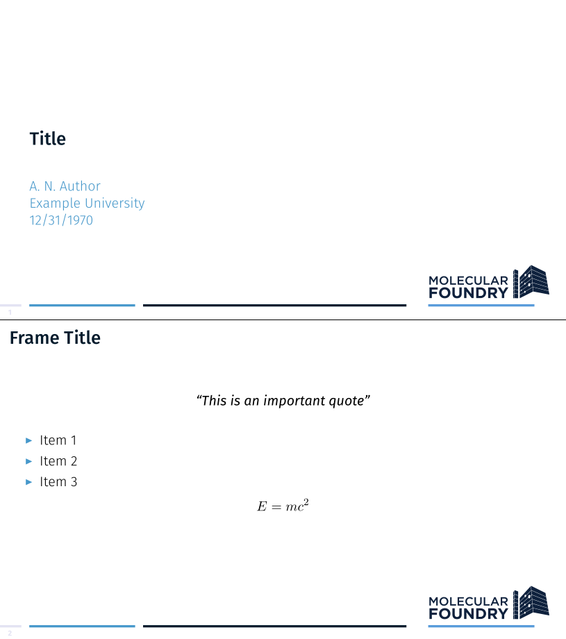

# Unofficial Beamer/LaTeX templates for The Molecular Foundry at Lawrence Berkeley National Laboratory

The style and class files included here were designed for document and
presentation preparation for work at The Molecular
Foundry. The
[brand guidelines](http://foundry.lbl.gov/assets/docs/media/Molecular_Foundry_Brand_Guidelines-2015.pdf) and
[presentation templates](http://foundry.lbl.gov/media/) were used to
obtain as close a resemblance as possible to the official templates
The Molecular Foundry provides.

Logos are provided in `logo_pack`, and were originally sourced from:
 - 
 - 
 - 
   (with some editing)

## Examples

```tex
\usetheme{molecular-foundry}
```


### Options
 - `framenumbering` adds the current and total slide numbers in the bottom left corner

## Installation
Clone this repo to your `~/texmf` directory

```tex
git clone git@github.com:michaelplews/molecular-foundry-tex.git ~/texmf/tex/
```

## Requirements

### Fonts
In accordance with
the
[brand guidelines](http://foundry.lbl.gov/assets/docs/media/Molecular_Foundry_Brand_Guidelines-2015.pdf),
Fira Sans font is used in presentations. Fira Sans can be found from
Google fonts, [here](https://fonts.google.com/specimen/Fira+Sans),
free of charge.

### Compiling
Due to font requirements (from `fontspec`), all files should be compiled with `lualatex`:
```bash
latexmk -lualatex my_file.tex
```
